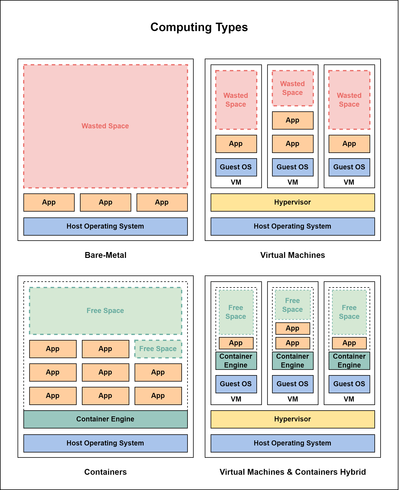

---
# Basic Note Frontmatter
title: Docker
tags: [Reference]
description: "Get up and running with one of the most popular containerization service"
# Site Configurations
share: true
sidebar_position: 1
# Dataview Fetch Fields
content_type: MOC
content_topics:
 - Dev-Ops
 - Containerization
---
```mdx-code-block
import Tabs from '@theme/Tabs';  
import TabItem from '@theme/TabItem';
```
## Why Containers?
Containers are the talk of the town these days. It is no secret that in the recent years a lot of businesses have started to adopt containerization technology and are starting to reap the benefits out of it. To understand why containerization came to existence, it is required to understand the problems that it aimed to fix in the industry.

### Age of Bare-Metal Hardware
Applications and services form the basis of all enterprises and businesses. These applications and services run on servers. And by convention, due to several operational best practices, one server runs only one application. This meant that for `n` number of applications, `n` number of servers were required to be bought, licensed for, set-up, hosted, maintained, patched and decommissioned by the IT operations team.

This might not sound like a tedious and an error prone task, but the following list captures some of the shortcomings of this method.
1. **Capacity Calculations** - Miscalculation (underestimation/overestimation) of the capacity needed to host and serve the application.
2. **Untapped Potential** - Closely related to the capacity calculation, if the required capacity is overestimated, the hardware and the capacity of the server goes underutilized.
3. **Service Constraints** - The opposite end of the spectrum of untapped potential is being bottlenecked by the hardware due to insufficient space for the application to grow. To circumvent this, IT bought big and bigger hardware, which circles back to the resource being underutilized.
4. **Licensing Cost** - Often operating systems like those that run enterprise grade applications cost a lot of money to buy and maintain.
5. **Patch Work** - Patching the operating systems and application means that the service had to be taken down completely and worked on.

### Virtualization to the rescue

#### VMs, the first step in virtualization
At the time when the operations team were so frustrated about the single-host, bare-metal hardware architecture, [VMware](https://www.vmware.com/) came up with the solution called as Virtual Machines. Virtual Machines (VMs) are ways to run multiple, isolated operating systems in a single operating system. This shook the industry overnight (for the better of course). The following are some of the advantages when it comes to VMs over bare-metal hardware.
- Each machine (server) could now host as many application as the server's resources allow.
- This reduced the need to procure new servers for each of the new application that the business decides to implement.
- The environments in which these applications reside (called the virtual machine) came with its own operating system, meaning full isolation and data security.
- This enabled companies to fully utilize their existing infrastructure.

However, VMs also had some issues and the following are some of the shortcomings.
1. **Wasted Space and Potential** - As each VM comes with its own Operating System, they tend to take up space that could be used by the application itself.
2. **Licensing Cost** - As each VM has to come with its own Operating System, it means that each of those operating systems cost money to buy and patch.
3. **Operational Constraints** -  VMs are less portable and are slow to boot. This was a nightmare for teams that manage a hybrid deployment between cloud and on-premises infrastructure.

#### The Good, the Better and Containers
Containers came into existence to fix the problems that VMs had. In a way Containers are like VMs, in that they provide isolation between the applications and the host hardware and operating system. But, they solve some of the crucial pain points of the previous 2 computing paradigms namely bare-metal and virtual machines, which is tabulated below.

| The Pain Point                                | Containers and Answers                                                                                                                                                                                                                                                                                                                                                         |
| --------------------------------------------- | ------------------------------------------------------------------------------------------------------------------------------------------------------------------------------------------------------------------------------------------------------------------------------------------------------------------------------------------------------------------------------ |
| Clunky OS and Dependencies                    | Containers share the the same OS as the Host Hardware. There is no duplication of the OS for each and every instance of an application being deployed in containers. This also means that there is no additional cost and overhead of maintaining the OS Licenses for each and every instance (bare-metal or VM).                                                              |
| Capacity Miscalculations and Utilization Gaps | Containers utilize only the resources allocated to them. All remaining resources are available for utilization by other containers. This ensures that no resource goes wasted in capacity.                                                                                                                                                                                     |
| Portability and Scaling                       | Being lightweight and conforming to a standard (usually follow a set standard), containers are extremely portable, where almost all cloud providers allow running containers with little to no headway in setting up the environment. Moreover, as containers are units of operations, multiple containers can be deployed thus horizontally scaling the operational capacity. |
| Operational Speed                             | As containers share the kernel with the operating system, they are much faster than VMs to boot-up and get to an operational state.                                                                                                                                                                                                                                                                                                                                                                                |

:::tip About Dependencies and Libraries
All operating systems and virtual environments require certain supporting tools to keep the machine running. These are always required no matter the technology used, may it be bare-metal hosts, VMs or containers. 
:::

### So, Which is the best?
Both virtualization technologies VMs and Containers solve some of the crucial problems faced by deploying to bare-metal instances. In an ideal world, containers are not directly deployed onto bare-metal instances. Instead, Bare-metal instances host VMs, which in turn host containers. This brings the best of both worlds while maintaining operational best practices. 

**Read More:** [Explore the benefits of containers on bare metal vs. on VMs | TechTarget](https://www.techtarget.com/searchitoperations/tip/Explore-the-benefits-of-containers-on-bare-metal-vs-on-VMs)



---
## Introduction to Docker
Containerization technology has been around for longer before Docker popularized it. But it was Docker which made the containerization technology accessible to the common people.

### Docker - The Technology vs Docker - The Company
The term Docker could refer to two things,
1. Docker, Inc. - The company behind developing the product.
2. [Docker](https://www.docker.com/) - One of the the products the company offers.

#### A brief history about Docker, Inc.
Docker, Inc is an American technology company that develops tools around the containers and technologies that enable it. The company was founded in 2008 with the name **dotCloud** by Kamel Founadi, Solomon Hykes and Sebastian Pahl in Paris and later moved to the US in 2010. The company was renamed to Docker in 2013. 

Check out more about the company through [Docker, Inc. website](https://www.docker.com/company/). The above paragraph is condensed from Wikipedia, [check here for the Wikipedia article](https://en.wikipedia.org/wiki/Docker,_Inc.)

Some of the popular products of Docker, Inc. include,
- [Docker Hub](https://hub.docker.com/) - A central repository of containers.
- [Docker Desktop](https://www.docker.com/products/docker-desktop/) - Desktop GUI for Windows and Mac platforms.

Docker also offers several pricing tiers with varied feature set. Check out [Docker's pricing page here](https://www.docker.com/pricing/).

#### A brief history about Docker 


### From Linux to everywhere
Docker traditionally was developed to work on the Linux OS, but slowly with Microsoft's contributions and close support with Docker, Inc. the platform is also available for Windows. This gave birth to 2 types of containers namely,
1. Linux Containers - Runs on Windows, Mac and Linux
2. Windows Containers - Runs on Windows


```mdx-code-block
<Tabs groupId="Linux-and-Windows-Containers-Distinction">
<TabItem value="Linux containers">
```

```bash
docker pull ubuntu:latest
```

```mdx-code-block
</TabItem>
<TabItem value="Windows Containers">
```

```PowerShell
docker pull mcr.microsoft.com/powershell:lts-nanoserver-1903
```

```mdx-code-block
</TabItem>
</Tabs>
```


As containers share the kernel of the host operating system, Windows containers cannot run on a Mac or Linux. However, thanks to Microsoft's support for Linux, Windows containers as well as Linux containers can run on Windows.

---
## Docker Installation
[Refer the Docs](https://docs.docker.com/get-docker/) for the latest information on instructions for how to install docker for the platform of your choice. Docker is available (thanks to the contribution of countless open source contributions) on Linux, Windows and Mac. However, the way the containerization is implemented varies slightly across the platforms.

---
## Docker Architecture
Docker follows a simple client-server architecture along with a central repository to store and serve the images. Thus, there are 3 main components in a docker implementation.
1. **Docker Client**
	- It connects to the docker engine to *send and receive commands and outputs*.
	- It could be a *GUI Application* such as Docker Desktop (available for Windows and Mac) or a *CLI Tool* available for Docker CLI (Windows, Mac and Linux).
	- Client can exist on the same machine as the Docker Engine or exist on a different machine.
2. **Docker Engine (or) Docker Daemon**
	- It performs all operations related to containers throughout their lifetime.
	- Often referred to as `dockerd` (pronounced as `docker-dee`).
	- It manages several container objects such as images, containers, volumes, networks and other plugins.
3. **Image Repository**
	-  A storage location for container images.
	- It could be the official repository from Docker Inc., [Docker Hub](https://hub.docker.com/) or from a third-party provider such as AWS, Azure or GCP or locally maintained by a company.

Docker communicates across the client, engine and repository by means of *REST API* calls. 

### Docker Client
- The docker client provides a primary way for the users to interact with docker.
- It provides an interface to manage container objects such as images, containers, volumes, networks and other plugins.
- Docker client is available as
	1. **Docker CLI** - Available in Windows, Mac and Linux.
	2. **Docker Desktop** - Available on Windows and Mac.

### Docker Engine


---
## Images and what they capture


---
## Containers and what they do


---
## Deployment with Docker Compose


---
## Container Orchestration with Docker Swarm


---
## Networking


---
## Overlay Networking


---
## Persisting Data with Volumes


---
## App Deployment with Stacks


---
## Focussing on Security


---
[Docker Reference Cookbook](../../Docker-Reference-Cookbook.md)

## Building Images with Dockerfile
- **Pull a container image from a repository:** `docker pull image:tag`
- **Run a container:** `docker run image:tag`
- **Docker ps command:** `docker ps <flags>` --> `docker ps -a` (all containers, running or not)
- **Docker stop command:** `docker stop <container_name/container_id>`
- **Docker rm command:** `docker rm <container_name/container_id>`
- **List local images:** `docker images` or `docker images ls`
- **Execute a command on a container:** `docker exec <container_name/container_id> <command>`
- **Running in detached mode:** `docker run -d image:tag`
- **Attach a detached container:** `docker attach <container_name/container_id>`
